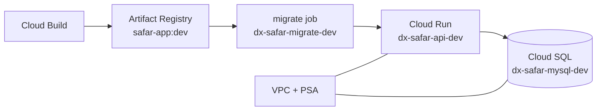

# Infrastructure Architecture

## 1. Purpose and Scope

本書は Safar のインフラ構成を定義する。アプリ配布、データサービス基盤、外部連携、環境分離、IaC を扱う。アプリ/データサービスのアーキテクチャは [architecture.md](./architecture.md) を参照。

---

## 2. Overview

Safar はモバイル向け PWA（Next.js モノリス）と MySQL データストアで構成される。GCP 上では **単一プロジェクト** `dx-safar` に dev / stg / prod を `env_suffix` で分離する。

| 項目 | 値 |
|---|---|
| アプリ配布（エンドユーザー） | PWA（ブラウザ）— 将来 App Store / Google Play 導線あり |
| データサービス実行基盤 | **GCP Cloud Run**（Next.js standalone、1 サービス / 環境） |
| データストア | **Cloud SQL for MySQL 8**（VPC プライベート IP） |
| コンテナレジストリ | **Artifact Registry** `dx-safar-docker` |
| IaC | **Terraform + Terragrunt**（`google-cloud/terraform/`） |
| リージョン | `asia-northeast1`（東京） |
| GCP プロジェクト | `dx-safar` |
| 地図 / OCR / 翻訳 / 音声 | 外部プロバイダ（Cloud Vision / Translation は今後連携） |
| ドメイン | 初期は `*.run.app`（カスタムドメインは Terraform で任意） |

### ランタイム構成（dev 例）



- **モノリス:** フロント（App Router）と API（Route Handlers）を同一イメージ `safar-app` で配備。Kumu 由来の Terraform では Cloud Run の「api」スロットを流用（`enable_web = false`）。
- **マイグレーション:** デプロイ前に Cloud Run Job `dx-safar-migrate-{env}` で `prisma migrate deploy` を実行。
- **シークレット:** `DATABASE_URL` は Terraform（`enable_cloud_sql = true`）が Secret Manager に作成・マウント。平文の tfvars / git には置かない。

運用手順の詳細: [google-cloud/DEPLOY_GUIDE.md](../../google-cloud/DEPLOY_GUIDE.md)

---

## 3. 環境

単一 GCP プロジェクト `dx-safar` 内でリソース名 `{project_id}-{component}-{env_suffix}` により分離する。

| 環境 | `env_suffix` | 用途 | 状態 |
|---|---|---|---|
| dev | `dev` | 開発・結合 | **稼働中**（bootstrap + network + app） |
| stg | `stg` | 検証 | 未構築（tfvars テンプレートあり） |
| prod | `prod` | 本番（限定パイロット） | 未構築 |

### Terraform スタック順

| 順序 | スタック | 状態バケット prefix | 役割 |
|---|---|---|---|
| 1 | `live/bootstrap` | ローカル → GCS `dx-safar-terraform-state` | 状態バケット、AR、Cloud Build ライフサイクル |
| 2 | `live/{env}/network` | `network/{env}` | VPC、Private Service Access |
| 3 | `live/{env}/app` | `app/{env}` | Cloud Run、Cloud SQL、Secret、IAM |

### dev のコスト最適化

`enable_sql_night_weekend_schedule = true` — 平日 22:00–翌 08:00 および週末に Cloud SQL を停止（JST）。夜間の DB 接続は失敗する点に注意。

### 初期 dev で無効のモジュール

Vertex AI、GCS アップロード、LB/DNS/Armor、Cloud Scheduler クロン、本番向け監視 — モジュールは残し tfvars でオフ。

---

## 4. デプロイ・CI/CD

### 手動デプロイ（dev）

リポジトリルートから:

```bash
gcloud config set project dx-safar
bash google-cloud/scripts/cloud-build-submit.sh google-cloud/cloudbuild/cloudbuild.dev.yaml
```

フロー: イメージビルド → AR プッシュ → migrate job 更新・実行 → `dx-safar-api-dev` へデプロイ。

### 初回インフラ

```bash
cd google-cloud/terraform/live/bootstrap && terragrunt apply
cd ../dev/network && terragrunt apply
cd ../app && terragrunt apply
```

`terraform.tfvars` は `*.example` からコピー（gitignore）。詳細は [DEPLOY_GUIDE.md](../../google-cloud/DEPLOY_GUIDE.md)。

### CI/CD（任意）

| ブランチ | Cloud Build 設定 | イメージタグ |
|---|---|---|
| `develop` | `cloudbuild.dev.yaml` | `dev` |
| `staging` | `cloudbuild.dev.yaml` | `stage` |
| `production` | `cloudbuild.prod.yaml` | `prod` |

GitHub Actions: Workload Identity Federation（`.github/workflows/cd-gcp.yml`）。セットアップ: [GITHUB_ACTIONS_WIF.md](../../google-cloud/cloudbuild/GITHUB_ACTIONS_WIF.md)。

### スモークテスト

```bash
cd google-cloud/terraform/live/dev/app && terragrunt output
curl -I https://dx-safar-api-dev-....run.app
```

シード（一度だけ）: migrate job のコマンド上書きで `npx prisma db seed`。

---

## 5. データ更新パイプライン（論点）

- 商品DB：JAN→成分の調達元・更新頻度（Open Food Facts 連携済み、運用頻度は TBD）
- NG 成分辞書：メンテ主体・レビュー体制（TBD）

---

## 6. 監視・運用

| 項目 | 現状 |
|---|---|
| ログ | Cloud Logging（Cloud Run / Cloud Build） |
| 稼働監視 | 未構成（Monitoring モジュールは tfvars でオフ） |
| DB バックアップ | dev: オフ想定 / **prod 必須**（`sql_backup_enabled`, `sql_deletion_protection`） |
| 障害時 | [DEPLOY_GUIDE.md §11](../../google-cloud/DEPLOY_GUIDE.md#11-common-troubleshooting) 参照 |

---

## 7. 関連ドキュメント

| トピック | パス |
|---|---|
| GCP デプロイ手順（Runbook） | [google-cloud/DEPLOY_GUIDE.md](../../google-cloud/DEPLOY_GUIDE.md) |
| Terraform レイアウト | [google-cloud/terraform/README.md](../../google-cloud/terraform/README.md) |
| 命名・tier・IAM 方針 | [google-cloud/terraform/wiki.md](../../google-cloud/terraform/wiki.md) |
| ローカル開発 | [SETUP.md](../../SETUP.md) |
| チーム向け総合ガイド | [team-guide.md](../team-guide.md) |

---

## 8. Open Questions

| # | 項目 | 備考 |
|---|---|---|
| I1 | ~~データサービス実行基盤・データストア選定~~ | **確定:** Cloud Run + Cloud SQL |
| I2 | 外部プロバイダ（地図/OCR/翻訳/音声）の契約・コスト・データ所在 | 未着手 |
| I3 | 商品DB の調達・更新運用 | Open Food Facts は実装済み |
| I4 | ~~環境分離と IaC 採否~~ | **確定:** 単一プロジェクト + Terragrunt、suffix 分離 |
| I5 | 要配慮情報の保管リージョン・暗号鍵管理 | `asia-northeast1`、Secret Manager 利用 |
